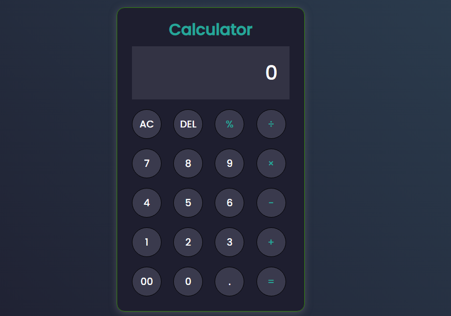

# 🧮 Calculator App  
*A responsive calculator built with HTML, CSS, and JavaScript.*  

## 📸 UI Overview
<div align="center">
  
  <p><em>Standalone calculator interface showing default state</em></p>
</div>

## ✨ Features  
- Basic operations (+, -, *, /, %)  
- Clean UI with animations  
- Keyboard support (Enter key)

## 🛠️ Tech Stack  
- **Frontend**: Vanilla JavaScript, CSS3, HTML5  
- **Special Features**:  
  - Error handling for division by zero  
  - Keyboard input support (Enter key)  
  - Smooth button animations 

## 🛠️ Run Locally  
```bash
git clone https://github.com/your-username/calculator-app.git
open calculator.html

